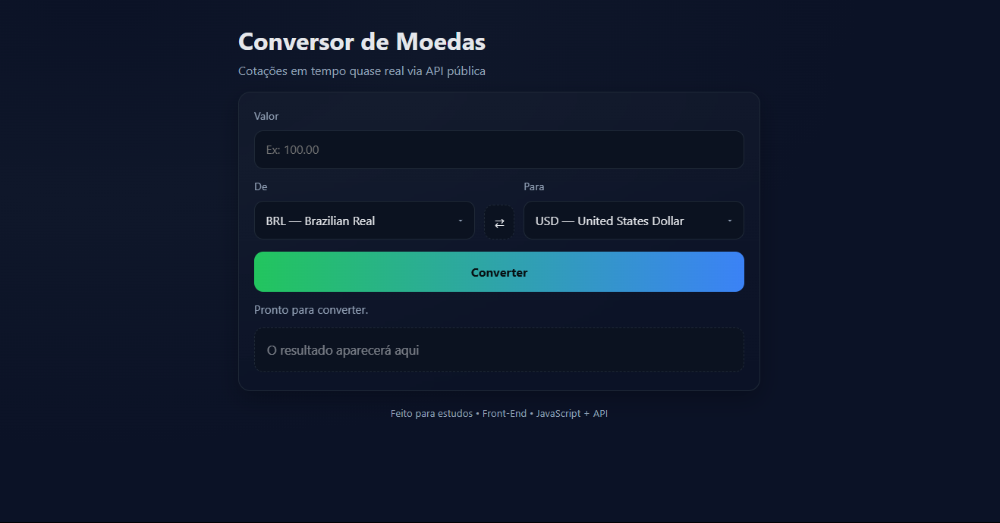

# 💱 Conversor de Moedas

Aplicação simples de conversão de moedas em tempo real, desenvolvida para estudos de **Front-End Development**.  
O projeto consome a [API Frankfurter](https://www.frankfurter.app/) para obter taxas de câmbio atualizadas e exibe os resultados de forma dinâmica.

## 🚀 Tecnologias utilizadas
- **HTML5**
- **CSS3**
- **JavaScript (ES6+)**
- **API externa (Frankfurter)**
- Deploy: **Vercel**

## 📸 Preview

## 🌐 Deploy
🔗 [Acesse o projeto online](https://conversor-monetario-sigma.vercel.app)

## ⚙️ Funcionalidades
- Conversão de valores entre diferentes moedas
- Cotação atualizada em tempo quase real (API Frankfurter)
- Interface responsiva com tema escuro
- Botão de troca rápida (⇄) entre moedas
- Preferências de moeda salvas em localStorage
- Formatação numérica conforme o idioma do navegador
- Estados de carregamento/erro com mensagens amigáveis

---

# 💱 Currency Converter (EN)

A simple real-time currency converter app, built as part of my **Front-End Development** studies.  
It uses the [Frankfurter API](https://www.frankfurter.app/) to fetch updated exchange rates and display results dynamically.

## 🚀 Tech stack
- **HTML5**
- **CSS3**
- **JavaScript (ES6+)**
- **External API (Frankfurter)**
- Deployment: **Vercel**

## 📸 Preview

## 🌐 Live Demo
🔗 [Check the project online](https://conversor-monetario-sigma.vercel.app)

## ⚙️ Features

- Currency conversion between multiple currencies
- Near real-time rates (Frankfurter API)
- Responsive UI with dark theme
- Quick swap button (⇄) to invert currencies
- Preferred currencies saved in localStorage
- Locale-aware number formatting
- Loading/error states with friendly messages
- Quick swap button (⇄) to invert currencies
- User preferences stored in `localStorage`
